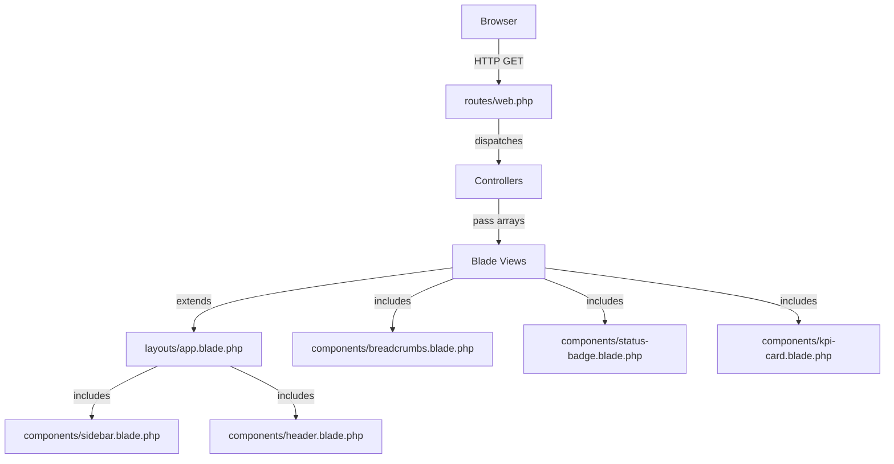

# Design Document — DOMS Interactive Dashboard

## Overview

The DOMS Interactive Dashboard is a Laravel 13 / Blade-only web application that provides an Owner/Admin with a real-time operational view of a delivery business. The design follows a single-page-template pattern: one shared app layout wraps every page; all data for the demo is hard-coded in controllers as PHP arrays so the interface is fully functional without running migrations. Database migrations and seeders are included for production readiness.

### Key Design Decisions

| Decision | Rationale |
|---|---|
| Hard-coded controller data | Allows demo to run without DB; no authentication needed |
| Single `layouts/app.blade.php` | Consistent shell; sidebar, header, breadcrumbs in one place |
| Named routes throughout | `route('trips.show', $id)` keeps views clean and refactorable |
| Route Model Binding with integer IDs | Laravel convention; works identically against real DB later |
| PKR currency helper | Centralized formatting, easy to globalise |
| Tailwind v4 utility classes | No custom CSS layers needed; status badge classes inline |
| One controller per section | Low coupling; each controller owns its dummy-data fixture |

---

## Architecture



### Request Lifecycle (Demo Mode)

1. Browser sends GET request.
2. `web.php` matches named route → dispatches controller method.
3. Controller method builds a PHP array (fixture data) and calls `view()`.
4. Blade view `@extends('layouts.app')` and `@section('content', ...)`.
5. Layout renders sidebar, header, breadcrumbs, then the page content section.
6. Vite-compiled CSS/JS served from `public/build`.

---

## Components and Interfaces

### Route Structure

All routes are in `routes/web.php`. Every route is named.

```php
// Dashboard
Route::get('/', [DashboardController::class, 'index'])->name('dashboard');

// Trips
Route::get('/trips',          [TripController::class, 'index'])->name('trips.index');
Route::get('/trips/{id}',     [TripController::class, 'show'])->name('trips.show');

// Deliverymen
Route::get('/deliverymen',      [DeliverymanController::class, 'index'])->name('deliverymen.index');
Route::get('/deliverymen/{id}', [DeliverymanController::class, 'show'])->name('deliverymen.show');

// Markets
Route::get('/markets',      [MarketController::class, 'index'])->name('markets.index');
Route::get('/markets/{id}', [MarketController::class, 'show'])->name('markets.show');

// Invoices
Route::get('/invoices',      [InvoiceController::class, 'index'])->name('invoices.index');
Route::get('/invoices/{id}', [InvoiceController::class, 'show'])->name('invoices.show');

// Stock / SKUs
Route::get('/stock',      [StockController::class, 'index'])->name('stock.index');
Route::get('/stock/{id}', [StockController::class, 'show'])->name('stock.show');

// Returns
Route::get('/returns', [ReturnController::class, 'index'])->name('returns.index');

// Collections
Route::get('/collections', [CollectionController::class, 'index'])->name('collections.index');

// Settlements
Route::get('/settlements', [SettlementController::class, 'index'])->name('settlements.index');

// Ledgers (Deliveryman ledger is part of DeliverymanController; Market ledger part of MarketController)
// Dedicated ledger listing page (optional overview)
Route::get('/ledgers', [LedgerController::class, 'index'])->name('ledgers.index');

// Reports
Route::get('/reports',                     [ReportController::class, 'index'])->name('reports.index');
Route::get('/reports/trips',               [ReportController::class, 'trips'])->name('reports.trips');
Route::get('/reports/deliverymen',         [ReportController::class, 'deliverymen'])->name('reports.deliverymen');
Route::get('/reports/financial-summary',   [ReportController::class, 'financialSummary'])->name('reports.financial-summary');
Route::get('/reports/markets',             [ReportController::class, 'markets'])->name('reports.markets');
Route::get('/reports/stock',               [ReportController::class, 'stock'])->name('reports.stock');
Route::get('/reports/sku-movement',        [ReportController::class, 'skuMovement'])->name('reports.sku-movement');
Route::get('/reports/audit-trail',         [ReportController::class, 'auditTrail'])->name('reports.audit-trail');
```

### Controller Structure

One controller per major section. All controllers live in `App\Http\Controllers`.

| Controller | Methods | Responsibility |
|---|---|---|
| `DashboardController` | `index()` | KPI cards, today's trips table, recent collections panel, top shortages panel |
| `TripController` | `index()`, `show(int $id)` | Trip list with pagination fixture; trip detail with invoices, collections, returns, settlement |
| `DeliverymanController` | `index()`, `show(int $id)` | Deliveryman list; profile, trip history, summary panel, ledger entries |
| `MarketController` | `index()`, `show(int $id)` | Market list; market profile, invoice history, market ledger |
| `InvoiceController` | `index()`, `show(int $id)` | Invoice list; invoice detail with line items and collections panel |
| `StockController` | `index()`, `show(int $id)` | SKU list with stock status badges; SKU detail with movement history |
| `ReturnController` | `index()` | Returns list with status filter state passed to view |
| `CollectionController` | `index()` | Collections list with method filter, daily total |
| `SettlementController` | `index()` | Settlements list with summary totals row |
| `LedgerController` | `index()` | Overview listing of both ledger types (navigates to deliveryman/market detail) |
| `ReportController` | `index()`, `trips()`, `deliverymen()`, `financialSummary()`, `markets()`, `stock()`, `skuMovement()`, `auditTrail()` | Reports hub and individual report views |

#### Dummy Data Pattern

Each controller holds a `private static` fixture method (or inline array). Example structure for `TripController`:

```php
private function trips(): array
{
    return [
        [
            'id'          => 1,
            'trip_id'     => 'TR-2025-07-01-001',
            'date'        => '2025-07-01',
            'deliveryman' => ['id' => 1, 'name' => 'Ahmed Khan'],
            'vehicle'     => 'Toyota Hilux – ABC-123',
            'market_area' => 'Gulshan-e-Iqbal',
            'status'      => 'COMPLETED',
            'load_value'  => 125400,
            'expected_cash' => 98000,
            'source_dlf'  => 'DLF-2025-07-01-001',
        ],
        // ... more trips
    ];
}
```

The `show()` method finds by integer `$id`:

```php
public function show(int $id): View
{
    $trip = collect($this->trips())->firstWhere('id', $id)
        ?? abort(404);
    // attach invoices, collections, returns, settlement from local fixtures
    return view('trips.show', compact('trip', ...));
}
```

### Blade View Hierarchy

```
resources/views/
├── layouts/
│   └── app.blade.php               ← Single app shell
├── components/
│   ├── sidebar.blade.php           ← Persistent left nav
│   ├── header.blade.php            ← Top bar (app name, date, page title)
│   ├── breadcrumbs.blade.php       ← Breadcrumb trail component
│   ├── kpi-card.blade.php          ← Dashboard KPI card
│   ├── status-badge.blade.php      ← Reusable colored badge
│   └── data-table.blade.php        ← Generic table wrapper (optional)
├── dashboard/
│   └── index.blade.php             ← Main dashboard page
├── trips/
│   ├── index.blade.php             ← Trips list
│   └── show.blade.php              ← Trip detail
├── deliverymen/
│   ├── index.blade.php             ← Deliverymen list
│   └── show.blade.php              ← Deliveryman detail + ledger
├── markets/
│   ├── index.blade.php             ← Markets list
│   └── show.blade.php              ← Market detail + ledger
├── invoices/
│   ├── index.blade.php             ← Invoices list
│   └── show.blade.php              ← Invoice detail + line items
├── stock/
│   ├── index.blade.php             ← SKU list
│   └── show.blade.php              ← SKU detail + movement history
├── returns/
│   └── index.blade.php             ← Returns list with filter tabs
├── collections/
│   └── index.blade.php             ← Collections list with method filter
├── settlements/
│   └── index.blade.php             ← Settlements list with totals row
├── ledgers/
│   └── index.blade.php             ← Ledger overview page
└── reports/
    ├── index.blade.php             ← Reports hub (grid of cards)
    ├── trips.blade.php             ← Trip report view
    ├── deliverymen.blade.php       ← Deliveryman report view
    ├── financial-summary.blade.php ← Financial summary report
    ├── markets.blade.php           ← Market report view
    ├── stock.blade.php             ← Stock report view
    ├── sku-movement.blade.php      ← SKU movement report
    └── audit-trail.blade.php       ← Audit trail report
```

#### `layouts/app.blade.php` Structure

```html
<html>
  <head><!-- Vite CSS/JS --></head>
  <body class="flex h-screen bg-gray-100">
    @include('components.sidebar')
    <div class="flex flex-col flex-1 overflow-hidden">
      @include('components.header')
      <main class="flex-1 overflow-y-auto p-6">
        @isset($breadcrumbs)
          <x-breadcrumbs :items="$breadcrumbs" />
        @endisset
        @yield('content')
      </main>
    </div>
  </body>
</html>
```

#### `components/sidebar.blade.php`

The sidebar renders a `<nav>` with 11 links. The active link is determined by comparing the current route name using `request()->routeIs('trips.*')`.

Sidebar items with icons (Heroicons SVG inline or CSS icon classes):

| Icon | Label | Route Pattern |
|---|---|---|
| grid | Dashboard | `dashboard` |
| truck | Trips | `trips.*` |
| user-group | Deliverymen | `deliverymen.*` |
| map | Markets | `markets.*` |
| document-text | Invoices | `invoices.*` |
| cube | Stock | `stock.*` |
| arrow-uturn-left | Returns | `returns.*` |
| banknotes | Collections | `collections.*` |
| scale | Settlements | `settlements.*` |
| book-open | Ledgers | `ledgers.*` |
| chart-bar | Reports | `reports.*` |

#### `components/kpi-card.blade.php`

Props: `title`, `value`, `icon`, `color` (green/amber/red/blue), `route`.

```blade
@props(['title', 'value', 'icon', 'color' => 'blue', 'route' => '#'])
<a href="{{ $route }}" class="block bg-white rounded-xl shadow p-5 ...">
  <div class="flex items-center justify-between">
    <span class="text-sm text-gray-500">{{ $title }}</span>
    <span class="text-{{ $color }}-500"><!-- icon svg --></span>
  </div>
  <p class="mt-2 text-2xl font-bold text-gray-800">{{ $value }}</p>
</a>
```

#### `components/status-badge.blade.php`

Props: `status`. Maps status strings to Tailwind classes.

```blade
@props(['status'])
@php
$classes = match(strtoupper($status)) {
    'DRAFT'                => 'bg-gray-100 text-gray-600',
    'READY'                => 'bg-blue-100 text-blue-700',
    'DISPATCHED'           => 'bg-orange-100 text-orange-700',
    'COMPLETED'            => 'bg-teal-100 text-teal-700',
    'SETTLEMENT PENDING'   => 'bg-amber-100 text-amber-700',
    'SETTLED'              => 'bg-green-100 text-green-700',
    'CLOSED'               => 'bg-gray-200 text-gray-700',
    'DELIVERED'            => 'bg-green-100 text-green-700',
    'PARTIAL'              => 'bg-yellow-100 text-yellow-700',
    'NOT DELIVERED'        => 'bg-red-100 text-red-700',
    'RESERVICE'            => 'bg-purple-100 text-purple-700',
    'PENDING'              => 'bg-amber-100 text-amber-700',
    'RESTOCKED'            => 'bg-green-100 text-green-700',
    'IN STOCK'             => 'bg-green-100 text-green-700',
    'LOW STOCK'            => 'bg-amber-100 text-amber-700',
    'OUT OF STOCK'         => 'bg-red-100 text-red-700',
    'MARKET SHORT'         => 'bg-blue-100 text-blue-700',
    'DELIVERYMAN SHORT'    => 'bg-red-100 text-red-700',
    'APPROVED WRITE-OFF'   => 'bg-gray-100 text-gray-600',
    'PENDING INVESTIGATION'=> 'bg-amber-100 text-amber-700',
    default                => 'bg-gray-100 text-gray-600',
};
@endphp
<span class="inline-flex items-center px-2.5 py-0.5 rounded-full text-xs font-medium {{ $classes }}">
    {{ $status }}
</span>
```

#### `components/breadcrumbs.blade.php`

Props: `items` — array of `['label' => string, 'route' => string|null]`. Last item is non-linked.

---

## Data Models

### Migrations

All migrations live in `database/migrations/`. File naming convention: `YYYY_MM_DD_HHMMSS_{name}.php`.

#### `create_deliverymen_table`

```php
Schema::create('deliverymen', function (Blueprint $table) {
    $table->id();
    $table->string('name');
    $table->string('employee_id')->unique();
    $table->string('phone', 20);
    $table->date('joined_at');
    $table->boolean('is_active')->default(true);
    $table->timestamps();
});
```

#### `create_markets_table`

```php
Schema::create('markets', function (Blueprint $table) {
    $table->id();
    $table->string('name');
    $table->string('area');
    $table->string('contact_person')->nullable();
    $table->string('contact_phone', 20)->nullable();
    $table->decimal('outstanding_balance', 12, 2)->default(0);
    $table->timestamps();
});
```

#### `create_skus_table`

```php
Schema::create('skus', function (Blueprint $table) {
    $table->id();
    $table->string('sku_code')->unique();
    $table->string('product_name');
    $table->string('category');
    $table->integer('current_stock')->default(0);
    $table->integer('reorder_point')->default(0);
    $table->timestamps();
});
```

#### `create_trips_table`

```php
Schema::create('trips', function (Blueprint $table) {
    $table->id();
    $table->string('trip_id')->unique();          // TR-YYYY-MM-DD-NNN
    $table->date('date');
    $table->foreignId('deliveryman_id')->constrained('deliverymen');
    $table->string('vehicle');
    $table->string('market_area');
    $table->string('source_dlf')->nullable();
    $table->string('status')->default('DRAFT');   // DRAFT|READY|DISPATCHED|COMPLETED|SETTLEMENT PENDING|SETTLED|CLOSED
    $table->decimal('load_value', 12, 2)->default(0);
    $table->decimal('expected_cash', 12, 2)->default(0);
    $table->timestamps();
});
```

#### `create_invoices_table`

```php
Schema::create('invoices', function (Blueprint $table) {
    $table->id();
    $table->string('invoice_number')->unique();
    $table->foreignId('trip_id')->constrained('trips');
    $table->foreignId('market_id')->constrained('markets');
    $table->date('date');
    $table->decimal('total_value', 12, 2)->default(0);
    $table->string('status')->default('NOT DELIVERED'); // DELIVERED|PARTIAL|NOT DELIVERED|RESERVICE
    $table->timestamps();
});
```

#### `create_invoice_items_table`

```php
Schema::create('invoice_items', function (Blueprint $table) {
    $table->id();
    $table->foreignId('invoice_id')->constrained('invoices');
    $table->foreignId('sku_id')->constrained('skus');
    $table->integer('ordered_qty');
    $table->integer('delivered_qty')->default(0);
    $table->decimal('unit_price', 10, 2);
    $table->decimal('line_total', 12, 2)->storedAs('delivered_qty * unit_price');
    $table->timestamps();
});
```

> Note: SQLite does not support `storedAs` with the above expression. In the actual migration use a regular `decimal` column and compute the value in PHP before inserting.

#### `create_collections_table`

```php
Schema::create('collections', function (Blueprint $table) {
    $table->id();
    $table->string('collection_ref')->unique();
    $table->foreignId('invoice_id')->constrained('invoices');
    $table->foreignId('market_id')->constrained('markets');
    $table->foreignId('trip_id')->constrained('trips');
    $table->foreignId('deliveryman_id')->constrained('deliverymen');
    $table->decimal('amount', 12, 2);
    $table->string('method');                      // Cash|Cheque|Transfer
    $table->timestamp('collected_at');
    $table->timestamps();
});
```

#### `create_returns_table`

```php
Schema::create('returns', function (Blueprint $table) {
    $table->id();
    $table->string('return_ref')->unique();
    $table->foreignId('trip_id')->constrained('trips');
    $table->foreignId('deliveryman_id')->constrained('deliverymen');
    $table->foreignId('sku_id')->constrained('skus');
    $table->string('invoice_number')->nullable();
    $table->integer('qty_returned');
    $table->string('reason_code');                 // REFUSED|DAMAGED|EXPIRED|EXCESS
    $table->string('status')->default('Pending');  // Pending|Restocked
    $table->date('date');
    $table->timestamps();
});
```

#### `create_settlements_table`

```php
Schema::create('settlements', function (Blueprint $table) {
    $table->id();
    $table->string('settlement_ref')->unique();
    $table->foreignId('trip_id')->constrained('trips');
    $table->foreignId('deliveryman_id')->constrained('deliverymen');
    $table->date('date');
    $table->decimal('expected_cash', 12, 2);
    $table->decimal('collected_amount', 12, 2);
    $table->decimal('shortage_amount', 12, 2)->default(0);
    $table->string('shortage_classification')->nullable(); // Market Short|Deliveryman Short|Approved Write-Off|Pending Investigation
    $table->string('settlement_status')->default('Pending'); // Pending|Settled|Closed
    $table->timestamps();
});
```

#### `create_ledger_entries_table`

```php
Schema::create('ledger_entries', function (Blueprint $table) {
    $table->id();
    $table->string('ledger_type');                  // market|deliveryman
    $table->nullableMorphs('ledgerable');           // polymorphic: markets or deliverymen
    $table->string('reference')->nullable();        // Trip ID or Invoice Number
    $table->string('transaction_type');             // Sale|Collection|Shortage|Adjustment
    $table->decimal('debit', 12, 2)->default(0);
    $table->decimal('credit', 12, 2)->default(0);
    $table->decimal('running_balance', 12, 2)->default(0);
    $table->date('date');
    $table->timestamps();
});
```

### Eloquent Model Relationships

```
Deliveryman
  hasMany  Trip
  hasMany  Collection
  hasMany  Return (as 'returns' relation)
  hasMany  Settlement
  morphMany LedgerEntry (as ledgerable, ledger_type='deliveryman')

Market
  hasMany  Invoice
  hasMany  Collection
  morphMany LedgerEntry (as ledgerable, ledger_type='market')

Trip
  belongsTo  Deliveryman
  hasMany    Invoice
  hasMany    Collection
  hasMany    Return (as 'returns')
  hasOne     Settlement

Invoice
  belongsTo  Trip
  belongsTo  Market
  hasMany    InvoiceItem
  hasMany    Collection

InvoiceItem
  belongsTo  Invoice
  belongsTo  Sku

Sku
  hasMany  InvoiceItem
  hasMany  Return (as 'returns')

Collection
  belongsTo  Trip
  belongsTo  Invoice
  belongsTo  Market
  belongsTo  Deliveryman

Return
  belongsTo  Trip
  belongsTo  Deliveryman
  belongsTo  Sku

Settlement
  belongsTo  Trip
  belongsTo  Deliveryman

LedgerEntry
  morphTo  ledgerable
```

### PKR Currency Helper

Add a global helper in `app/helpers.php` (autoloaded via `composer.json`):

```php
if (! function_exists('pkr')) {
    function pkr(int|float $amount): string {
        return 'PKR ' . number_format($amount, 2);
    }
}
```

Register in `composer.json` autoload:

```json
"autoload": {
    "files": ["app/helpers.php"],
    ...
}
```

Use in Blade: `{{ pkr($trip['load_value']) }}`.

---

## Seed Data Strategy

### DatabaseSeeder Approach

The `DatabaseSeeder` calls individual seeders in dependency order:

```
DatabaseSeeder
  → DeliverymenSeeder    (5 deliverymen)
  → MarketsSeeder        (8 markets)
  → SkusSeeder           (20+ SKUs, 3+ categories)
  → TripsSeeder          (15 trips, last 30 days, all statuses)
  → InvoicesSeeder       (50+ invoices, 2-5 line items each)
  → CollectionsSeeder    (based on delivered/partial invoices)
  → ReturnsSeeder        (10+ returns, varied reason codes)
  → SettlementsSeeder    (all SETTLED + CLOSED trips)
  → LedgerEntriesSeeder  (consistent with collections + shortages)
```

Each seeder is idempotent via `updateOrCreate` keyed on the unique column (e.g., `trip_id`, `invoice_number`, `sku_code`). If any seeder fails, Laravel's default behavior leaves partial data — no explicit rollback (per Requirement 11.10).

### Seeder Fixtures Summary

**Deliverymen (5):** Ahmed Khan, Bilal Raza, Usman Tariq, Zubair Malik, Kashif Hussain — each with unique EMP-001..005, mobile numbers, join dates in 2023–2024.

**Markets (8):** Gulshan-e-Iqbal, North Nazimabad, Liaquatabad, Orangi Town, Korangi Industrial, SITE Area, Saddar, Clifton — each with contact person and phone.

**SKUs (20+):** Categories: Beverages (6 SKUs), Snacks (7 SKUs), Household (7 SKUs). Each has realistic names (e.g., "Pepsi 1.5L", "Lays Classic 100g"), varied stock levels including some below reorder point and one at zero.

**Trips (15):** 
- 2 DRAFT, 2 READY, 3 DISPATCHED (recent), 4 COMPLETED, 2 SETTLEMENT PENDING, 1 SETTLED, 1 CLOSED
- Dates span last 30 days
- Alternating deliverymen and market areas

**Invoices (50+):** 3–4 invoices per trip; statuses match trip status (dispatched → PARTIAL/DELIVERED mix).

**Collections:** One collection per DELIVERED invoice, partial amount for PARTIAL invoices. Methods distributed: ~60% Cash, ~25% Cheque, ~15% Transfer.

**Returns (10+):** Reason codes: REFUSED (4), DAMAGED (3), EXPIRED (2), EXCESS (2). Status: 7 Restocked, 4 Pending.

**Settlements (2):** One SETTLED, one CLOSED trip.

**Ledger Entries:** Market ledger: Debit on sale (invoice), Credit on collection. Deliveryman ledger: Debit on shortage, Credit on collection.

---

## Correctness Properties

*A property is a characteristic or behavior that should hold true across all valid executions of a system — essentially, a formal statement about what the system should do. Properties serve as the bridge between human-readable specifications and machine-verifiable correctness guarantees.*

The following properties were derived from the acceptance criteria prework. Redundant properties have been consolidated: the find-or-404 pattern (Req 3.3, 4.2, 5.2, 6.2, 7.3) is unified into Property 3; the breadcrumb-starts-at-Dashboard pattern (Req 3.9, 4.6, 5.5, 6.5, 7.5) is unified into Property 4; status badge coverage for trips, returns, stock, and settlements (Req 3.2, 7.2, 8.2, 10.2) is unified into Property 2; the arithmetic-totals pattern for collections and settlements (Req 9.2, 10.3) is unified into Property 5.

---

### Property 1: PKR formatting is consistent

*For any* numeric amount (integer or float ≥ 0), `pkr($amount)` SHALL return a string that starts with "PKR ", followed by a comma-formatted integer part, followed by exactly two decimal places — and SHALL NOT return null, an empty string, or a string missing the decimal suffix.

**Validates: Requirements 2.1, 9.2, 10.3**

---

### Property 2: Status badge always resolves to a non-empty CSS class

*For any* status string in the system's recognised vocabulary — covering all trip lifecycle states (DRAFT, READY, DISPATCHED, COMPLETED, SETTLEMENT PENDING, SETTLED, CLOSED), delivery outcomes (DELIVERED, PARTIAL, NOT DELIVERED, RESERVICE), return statuses (Pending, Restocked), stock statuses (In Stock, Low Stock, Out of Stock), and shortage classifications (Market Short, Deliveryman Short, Approved Write-Off, Pending Investigation) — the `status-badge` component SHALL render a span containing a non-empty Tailwind background-and-text class pair.

**Validates: Requirements 3.2, 7.2, 8.2, 10.2**

---

### Property 3: Fixture find-or-404 is total across all show pages

*For any* integer ID that exists in a controller's fixture data array, calling `show(int $id)` SHALL return HTTP 200. *For any* integer ID that does NOT exist in the fixture array, `show(int $id)` SHALL return HTTP 404. This property holds for all five show-page controllers: TripController, DeliverymanController, MarketController, InvoiceController, and StockController.

**Validates: Requirements 3.3, 4.2, 5.2, 6.2, 7.3**

---

### Property 4: Every detail page breadcrumb trail begins with Dashboard

*For any* detail page response (trips.show, deliverymen.show, markets.show, invoices.show, stock.show), the `$breadcrumbs` array passed to the view SHALL have its first element with `label = 'Dashboard'` and a non-null, non-empty `route` value pointing to the dashboard route.

**Validates: Requirements 3.9, 4.6, 5.5, 6.5, 7.5**

---

### Property 5: Aggregate monetary totals equal arithmetic sums of their rows

*For any* array of collection records, the "daily total" value computed and passed to the collections view SHALL equal the arithmetic sum of each record's `amount` field. *For any* array of settlement records, the summary-row values for Expected Cash, Collected Amount, and Shortage Amount SHALL each equal the arithmetic sum of those fields across all settlement records in the array. *For any* individual settlement record, `shortage_amount = expected_cash - collected_amount`.

**Validates: Requirements 9.2, 10.3, 3.7**

---

### Property 6: Stock status badge derivation is deterministic and exhaustive

*For any* pair of non-negative integers `(current_stock, reorder_point)`:
- If `current_stock = 0` AND `reorder_point > 0` → status SHALL be "Out of Stock"
- If `current_stock > 0` AND `current_stock < reorder_point` → status SHALL be "Low Stock"
- If `current_stock >= reorder_point` (including both = 0) → status SHALL be "In Stock"

These three cases are mutually exclusive and collectively exhaustive for all valid inputs.

**Validates: Requirements 7.2**

---

### Property 7: KPI card renders all required display elements

*For any* KPI card data array containing `title`, `value`, `icon`, `color`, and `route` fields with non-empty values, the rendered `kpi-card` component SHALL contain the title text, the value text, and an anchor element whose `href` attribute equals the expected route URL. No field SHALL be silently omitted.

**Validates: Requirements 2.2, 2.3**

---

### Property 8: Sidebar active link is exclusive per page

*For any* page load, the sidebar SHALL mark exactly one navigation link as active (i.e., exactly one link contains the active CSS class). The marked link SHALL correspond to the current route's section. No page SHALL produce zero active links or more than one active link simultaneously.

**Validates: Requirements 1.3**

---

### Property 9: Report card renders all three required elements

*For any* report card data array containing `title`, `description`, and `route` fields, the rendered report card SHALL contain the title text, the description text, and a "View Report" button or link whose `href` or action resolves to a non-empty URL. No element SHALL be omitted.

**Validates: Requirements 12.2**

---

## Error Handling

| Scenario | Handling |
|---|---|
| Unknown `$id` on show pages | `abort(404)` — Laravel renders default 404 page |
| Missing fixture key accessed in Blade | Use `$record['key'] ?? '—'` (null-coalescing throughout) |
| Vite manifest missing | `ViteException` — user runs `npm run build` |
| Returns with "Pending" badge failing to render | Blade `@if` guard: if status badge class is empty, throw `\RuntimeException` (per Req 8.2) |

---

## Testing Strategy

### Applicability Assessment

This feature involves:
- Primarily controller-to-view data passing (PHP arrays → Blade templates)
- HTTP routing and response assertions
- Pure helper function (`pkr()`) — **PBT-suitable**
- Status badge class derivation (pure function) — **PBT-suitable**
- Fixture find-or-404 logic — **PBT-suitable**

PBT is appropriate for the pure logic layers. UI rendering tests use example-based feature tests.

### Unit Tests (PHPUnit)

**`PkrHelperTest`** — tests the `pkr()` formatting function:
- Property test: for any non-negative number, output starts with "PKR " and ends with 2 decimal digits
- Edge cases: 0, very large numbers, floats with many decimal places

**`StatusBadgeTest`** — tests the badge class mapping:
- Property test: for any status in the known set, result is a non-empty string
- Edge test: unknown status falls back to default grey classes

**`StockStatusTest`** — tests the stock status derivation logic:
- Property test: for any `(current_stock, reorder_point)` pair, the derived status matches the three-rule specification

### Feature Tests (PHPUnit)

**`DashboardTest`**:
- `test_dashboard_loads_successfully()` — GET `/` returns 200
- `test_dashboard_contains_kpi_cards()` — response contains KPI card titles

**`TripControllerTest`**:
- `test_trips_index_returns_200()`
- `test_trips_show_returns_200_for_valid_id()`
- `test_trips_show_returns_404_for_invalid_id()`
- `test_trip_detail_contains_breadcrumb()`

**`DeliverymanControllerTest`**, **`MarketControllerTest`**, **`InvoiceControllerTest`**, **`StockControllerTest`** — same pattern as TripControllerTest.

**`ReturnsControllerTest`**:
- `test_returns_index_returns_200()`
- `test_pending_badge_renders_correct_class()`

**`SettlementControllerTest`**:
- `test_settlements_totals_row_is_accurate()`

**`CollectionControllerTest`**:
- `test_daily_total_equals_sum_of_amounts()`

### Property-Based Testing

Use **PHPUnit `#[DataProvider]`** (no additional PBT library required). Minimum 100 data combinations per property test via `range()` + seeded random generation in the data provider.

The following 9 correctness properties each map to at least one parameterized test:

| Property | Test Class | Description |
|---|---|---|
| P1 — PKR formatting | `PkrHelperTest` | 100+ random non-negative amounts |
| P2 — Status badge class | `StatusBadgeTest` | All ~19 known status strings |
| P3 — Fixture find-or-404 | `FixtureLookupTest` | Valid + invalid IDs for all 5 show controllers |
| P4 — Breadcrumb starts at Dashboard | `BreadcrumbTest` | All 5 detail page routes |
| P5 — Aggregate totals equal sums | `TotalsTest` | 100 random collection/settlement arrays |
| P6 — Stock status derivation | `StockStatusTest` | 100+ (current_stock, reorder_point) pairs |
| P7 — KPI card renders all fields | `KpiCardTest` | 50 random card data arrays |
| P8 — Sidebar active link is exclusive | `SidebarActiveTest` | All 11 named route groups |
| P9 — Report card renders all fields | `ReportCardTest` | All 7 report card definitions |

```php
// Example: pkr() property test
#[DataProvider('amountProvider')]
public function test_pkr_always_formats_correctly(int|float $amount): void
{
    // Feature: doms-dashboard, Property 1: PKR formatting is consistent
    $result = pkr($amount);
    $this->assertStringStartsWith('PKR ', $result);
    $this->assertMatchesRegularExpression('/^PKR \d{1,3}(,\d{3})*\.\d{2}$/', $result);
}

public static function amountProvider(): array
{
    $cases = [0, 0.01, 999.99, 1000, 100000, 99999999.99];
    mt_srand(42);
    for ($i = 0; $i < 100; $i++) {
        $cases[] = mt_rand(0, 9999999) / 100;
    }
    return array_map(fn ($n) => [$n], $cases);
}
```

Tag format: `// Feature: doms-dashboard, Property N: {property title}`

### Running Tests

```bash
php artisan test --compact
```

For a specific test:

```bash
php artisan test --compact --filter=PkrHelperTest
```


---

## CRUD Action Buttons and Modals

### Context

This is a Laravel Blade demo. There is no authentication, no database writes, and no POST/PUT/DELETE routes. All data lives in in-controller PHP arrays. Alpine.js is available globally (loaded via `layouts/app.blade.php`). Tailwind utility classes are used for layout; precise pixel-accurate colours are applied via inline `style=""` attributes to match the existing design system.

No new Blade component files are introduced for modals. Every modal is inlined directly in its list page view file, keeping each page self-contained and easy to inspect.

---

### Modal Component Approach

Each list page view that supports CRUD is wrapped in a single top-level `x-data` div that owns the modal state for that page:

```blade
<div x-data="{
    open: false,
    mode: 'create',
    selected: null,
    openCreate() { this.mode = 'create'; this.selected = null; this.open = true; },
    openEdit(record) { this.mode = 'edit'; this.selected = record; this.open = true; },
    openDelete(record) { this.mode = 'delete'; this.selected = record; this.open = true; },
    close() { this.open = false; }
}" @keydown.escape.window="close()">

    {{-- page content, table, buttons --}}

    {{-- inline modal --}}

</div>
```

**State fields:**

| Field | Type | Purpose |
|---|---|---|
| `open` | boolean | Controls modal visibility |
| `mode` | `'create'` \| `'edit'` \| `'delete'` | Which modal panel is shown |
| `selected` | object \| null | The row data passed to edit/delete panels |

The three helper methods (`openCreate`, `openEdit`, `openDelete`) are called from button `@click` handlers. `close()` is the single exit point, called by Cancel buttons, backdrop clicks, and the Escape key handler.

---

### Modal HTML Structure Pattern

The following pattern is used on every page. The backdrop and panel are siblings inside the `x-data` wrapper.

```html
<!-- Backdrop -->
<div
    x-show="open"
    x-transition:enter="transition ease-out duration-200"
    x-transition:enter-start="opacity-0"
    x-transition:enter-end="opacity-100"
    x-transition:leave="transition ease-in duration-200"
    x-transition:leave-start="opacity-100"
    x-transition:leave-end="opacity-0"
    @click="close()"
    style="position:fixed;inset:0;background:rgba(0,0,0,0.5);z-index:50;"
></div>

<!-- Panel -->
<div
    x-show="open"
    x-transition:enter="transition ease-out duration-200"
    x-transition:enter-start="opacity-0 scale-95"
    x-transition:enter-end="opacity-100 scale-100"
    x-transition:leave="transition ease-in duration-200"
    x-transition:leave-start="opacity-100 scale-100"
    x-transition:leave-end="opacity-0 scale-95"
    style="position:fixed;top:50%;left:50%;transform:translate(-50%,-50%);
           background:#fff;border-radius:0.75rem;box-shadow:0 4px 24px rgba(0,0,0,0.12);
           width:100%;max-width:480px;padding:1.5rem;z-index:51;"
    @click.stop
>
    {{-- mode-conditional content --}}
    <template x-if="mode === 'create' || mode === 'edit'">
        {{-- Create / Edit form --}}
    </template>
    <template x-if="mode === 'delete'">
        {{-- Delete confirmation --}}
    </template>
</div>
```

Key rules:
- `@click.stop` on the panel prevents backdrop click from bubbling through.
- `@keydown.escape.window` is on the `x-data` wrapper, not the panel.
- `x-transition` uses 200 ms enter/leave for both backdrop and panel.
- Body scroll locking is achieved with `x-effect="document.body.style.overflow = open ? 'hidden' : ''"` on the `x-data` wrapper div.

---

### Button Styles

All buttons use inline `style=""` for colour fidelity and Tailwind utility classes for spacing/radius.

**Header create button** (appears in page header):
```html
<button style="background:#3b82f6;color:#fff;"
        class="text-xs font-semibold px-4 py-2 rounded-lg">
    + Add …
</button>
```

**Row Edit button**:
```html
<button style="background:#f0fdf4;color:#16a34a;"
        class="text-xs font-semibold px-3 py-1.5 rounded-lg">
    Edit
</button>
```

**Row Delete button**:
```html
<button style="background:#fff1f2;color:#ef4444;"
        class="text-xs font-semibold px-3 py-1.5 rounded-lg">
    Delete
</button>
```

**Modal Save button**:
```html
<button style="background:#3b82f6;color:#fff;"
        class="text-sm font-semibold px-5 py-2 rounded-lg">
    Save
</button>
```

**Modal Cancel button**:
```html
<button @click="close()" style="background:#f1f5f9;color:#64748b;"
        class="text-sm font-semibold px-5 py-2 rounded-lg">
    Cancel
</button>
```

**Modal Confirm Delete button**:
```html
<button style="background:#ef4444;color:#fff;"
        class="text-sm font-semibold px-5 py-2 rounded-lg">
    Confirm Delete
</button>
```

**Form field style** (consistent across all modals):
```html
<input class="w-full text-sm"
       style="background:#fff;border:1px solid #e2e8f0;border-radius:0.375rem;padding:0.75rem;">
```

---

### Per-Page Action Additions

#### Trips (`trips/index.blade.php`)

**Header addition:** "New Trip" button calls `openCreate()`.

**Row actions:** Replace the solo "View →" link with a 3-button group:
```
[ View → ]  [ Edit ]  [ Delete ]
```
- Edit: `openEdit({{ json_encode($trip) }})`
- Delete: `openDelete({{ json_encode($trip) }})`

**Create / Edit modal fields:**

| Field | Input type | Notes |
|---|---|---|
| Trip ID | `text`, `readonly` | Auto-generated; shows `TR-YYYY-MM-DD-NNN` pattern; for create, pre-filled with a placeholder |
| Date | `date` | Defaults to today for create |
| Deliveryman | `select` | Options from `$trips` fixture (unique deliveryman names) |
| Vehicle | `text` | Optional |
| Market / Area | `text` | Required |
| Source DLF | `text` | Optional |

**Delete confirmation:** "Are you sure you want to delete Trip <span x-text="selected?.trip_id"></span>?"

---

#### Deliverymen (`deliverymen/index.blade.php`)

**Header addition:** "Add Deliveryman" button calls `openCreate()`.

**Row actions:** `[ View → ]  [ Edit ]  [ Delete ]`

**Create / Edit modal fields:**

| Field | Input type | Notes |
|---|---|---|
| Name | `text` | Required |
| Employee ID | `text` | Required |
| Phone | `text` | Required |
| Vehicle | `text` | Optional |
| Join Date | `date` | Required |

**Delete confirmation:** "Are you sure you want to delete <span x-text="selected?.name"></span>?"

---

#### Markets (`markets/index.blade.php`)

**Header addition:** "Add Market" button calls `openCreate()`.

**Row actions:** `[ View → ]  [ Edit ]  [ Delete ]`

**Create / Edit modal fields:**

| Field | Input type | Notes |
|---|---|---|
| Market Name | `text` | Required |
| Area / Region | `text` | Required |
| Contact Person | `text` | Optional |
| Contact Phone | `text` | Optional |
| Outstanding Balance | `number` | Defaults to `0` |

**Delete confirmation:** "Are you sure you want to delete <span x-text="selected?.name"></span>?"

---

#### Invoices (`invoices/index.blade.php`)

**Header addition:** "Add Invoice" button calls `openCreate()`.

**Row actions:** `[ View → ]  [ Edit ]  [ Delete ]`

**Create / Edit modal fields:**

| Field | Input type | Notes |
|---|---|---|
| Invoice Number | `text` | Required |
| Customer / Market | `text` | Required |
| Trip ID | `text` | Required |
| Date | `date` | Required |
| Total Value | `number` | Required, min 0 |
| Status | `select` | Options: DELIVERED, PARTIAL, NOT DELIVERED, RESERVICE |

**Delete confirmation:** "Are you sure you want to delete Invoice <span x-text="selected?.invoice_number"></span>?"

---

#### Stock (`stock/index.blade.php`)

**Header addition:** "Add SKU" button calls `openCreate()`.

**Row actions:** `[ View → ]  [ Edit ]  [ Delete ]`

**Create / Edit modal fields:**

| Field | Input type | Notes |
|---|---|---|
| SKU Code | `text` | Required |
| Product Name | `text` | Required |
| Category | `text` | Required |
| Current Stock | `number` | Required, min 0 |
| Reorder Point | `number` | Required, min 0 |

**Delete confirmation:** "Are you sure you want to delete SKU <span x-text="selected?.sku_code"></span>?"

---

#### Returns (`returns/index.blade.php`)

No create button (returns originate from trips; there is no standalone create flow in the demo).

**Row actions:** `[ Edit ]  [ Delete ]`

**Edit modal fields:**

| Field | Input type | Notes |
|---|---|---|
| Return ID | `text`, `readonly` | Read-only |
| Trip ID | `text` | |
| Deliveryman | `text` | |
| SKU | `text` | |
| Product Name | `text` | |
| Qty Returned | `number` | Min 1 |
| Reason Code | `select` | Options: REFUSED, DAMAGED, EXPIRED, EXCESS |
| Status | `select` | Options: Pending, Restocked |

**Delete confirmation:** "Are you sure you want to delete Return <span x-text="selected?.return_ref"></span>?"

---

#### Collections (`collections/index.blade.php`)

**Header addition:** "Add Collection" button calls `openCreate()`.

**Row actions:** `[ Edit ]  [ Delete ]`

**Create / Edit modal fields:**

| Field | Input type | Notes |
|---|---|---|
| Collection ID | `text`, `readonly` | Auto-generated; read-only |
| Date | `date` | Defaults to today |
| Customer / Market | `text` | Required |
| Invoice Number | `text` | Required |
| Trip ID | `text` | Required |
| Amount | `number` | Required, min 0 |
| Method | `select` | Options: Cash, Cheque, Transfer |
| Deliveryman | `text` | Required |

**Delete confirmation:** "Are you sure you want to delete Collection <span x-text="selected?.collection_ref"></span>?"

---

#### Settlements (`settlements/index.blade.php`)

No create button (settlements are generated from completed trips; no standalone create flow in the demo).

**Row actions:** `[ Edit ]  [ Delete ]`

**Edit modal fields:**

| Field | Input type | Notes |
|---|---|---|
| Settlement ID | `text`, `readonly` | Read-only |
| Trip ID | `text`, `readonly` | Read-only |
| Deliveryman | `text` | |
| Date | `date` | |
| Expected Cash | `number` | Min 0 |
| Collected Amount | `number` | Min 0 |
| Shortage Amount | `number` | Min 0 |
| Shortage Classification | `select` | Options: Market Short, Deliveryman Short, Approved Write-Off, Pending Investigation |
| Settlement Status | `select` | Options: Pending, Settled, Closed |

**Delete confirmation:** "Are you sure you want to delete Settlement <span x-text="selected?.settlement_ref"></span>?"

---

### Routes

No new routes are required. All modal open/close/form interactions are handled entirely client-side by Alpine.js. The Save and Confirm Delete buttons close the modal (`close()`) without submitting any data — this is a dummy/demo phase. No POST, PUT, or DELETE routes are added.

---

### Additional Correctness Properties

*The following properties extend the Correctness Properties section above.*

---

### Property 10: Every CRUD-enabled list page initialises Alpine state without errors

*For any* of the eight list pages that include CRUD modals (Trips, Deliverymen, Markets, Invoices, Stock, Returns, Collections, Settlements), the rendered HTML response SHALL contain an `x-data` attribute on the outermost wrapper div that includes the keys `open`, `mode`, and `selected` (or equivalent per-page naming). The rendered page SHALL return HTTP 200 and the `x-data` value SHALL be a syntactically valid JavaScript object expression that does not contain unescaped quotes or malformed JSON from PHP `json_encode` calls.

**Validates: Requirements 13.5, 14 (all), 15.5, 16 (all), 17.8, 18.8, 19.8, 20.6, 21.8, 22.6, 23.7**

---

### Property 11: Required modal fields carry the HTML `required` attribute

*For any* create or edit modal on a list page, every field designated as required in the per-page field table above SHALL have the HTML `required` attribute present in the rendered output. This holds universally across all pages and all required fields — no required field SHALL be rendered without its `required` attribute, ensuring the browser's native validation prevents empty-field submission and keeps the modal open.

**Validates: Requirements 13.2, 15.2, 17.2, 18.2, 19.2, 21.2, 23.5**
